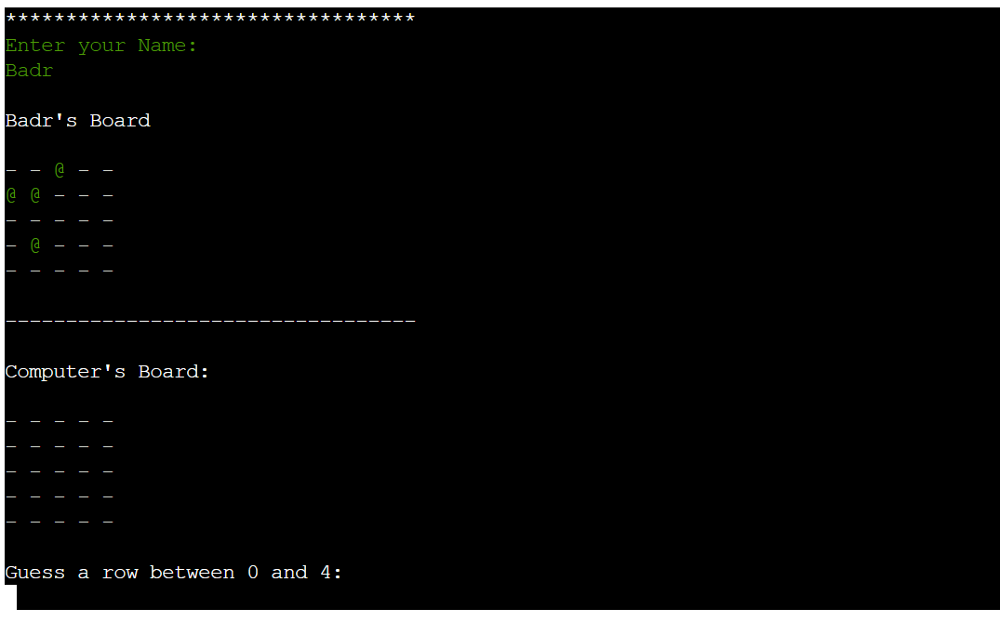
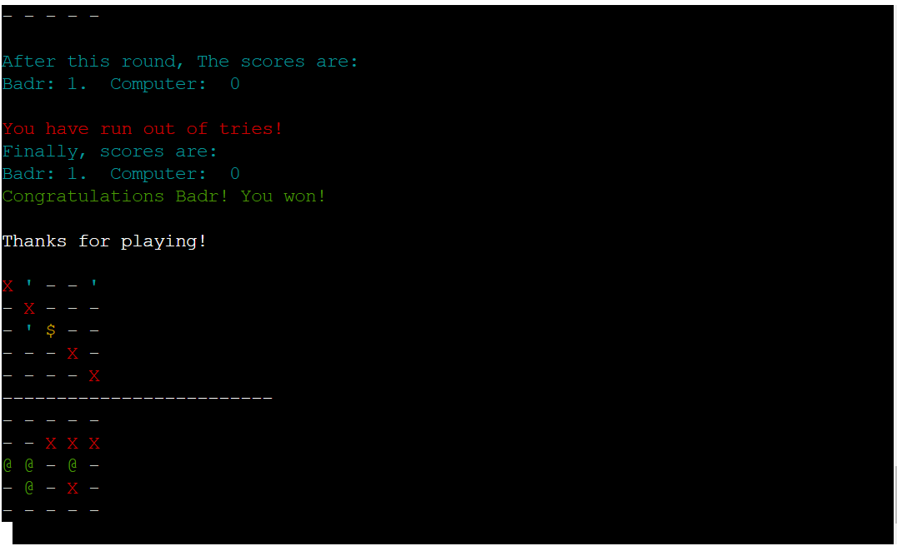
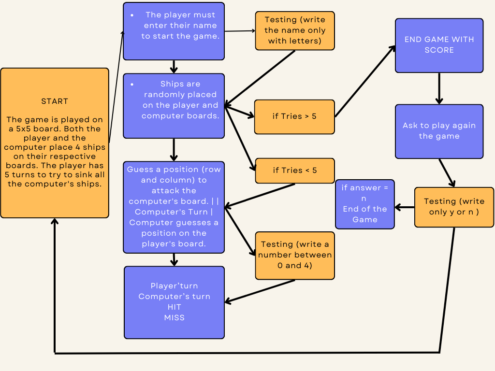
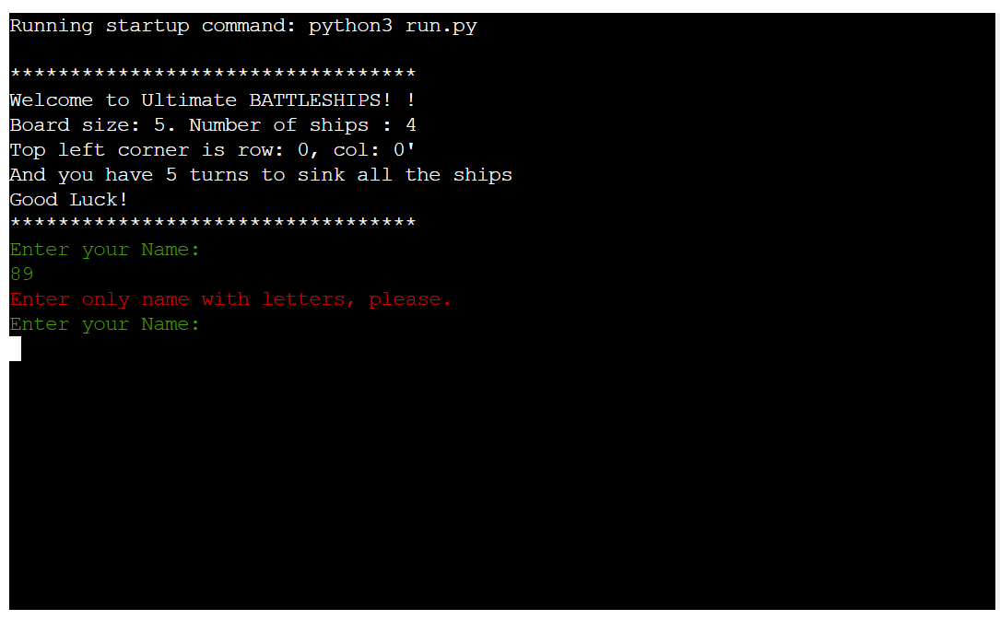
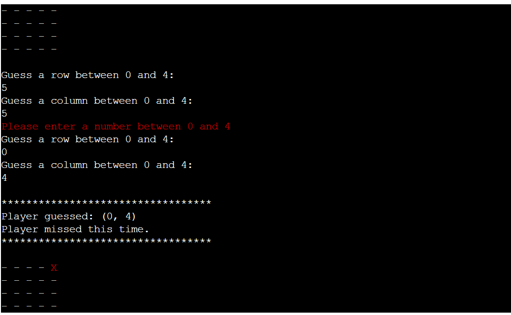
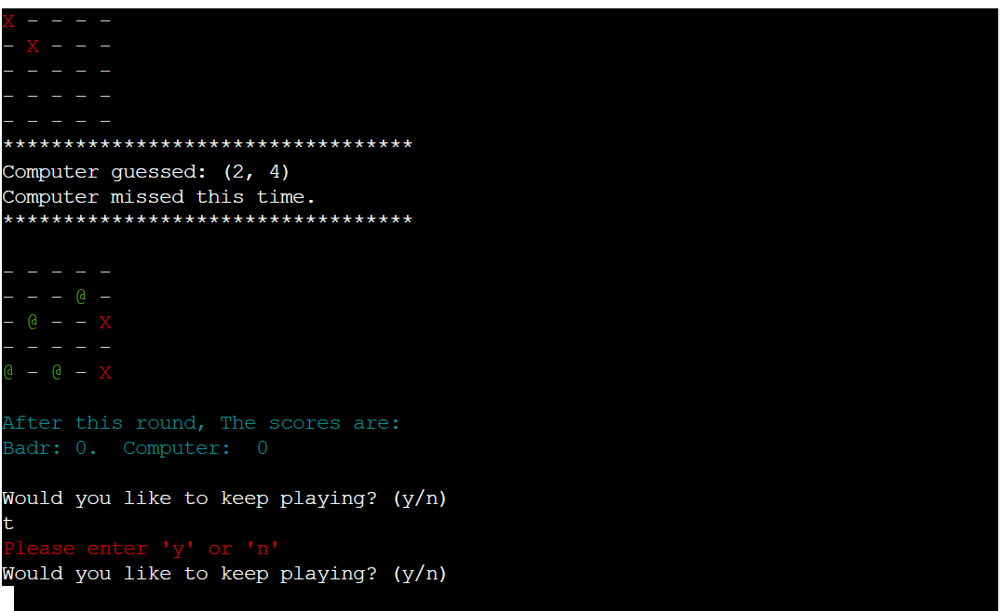
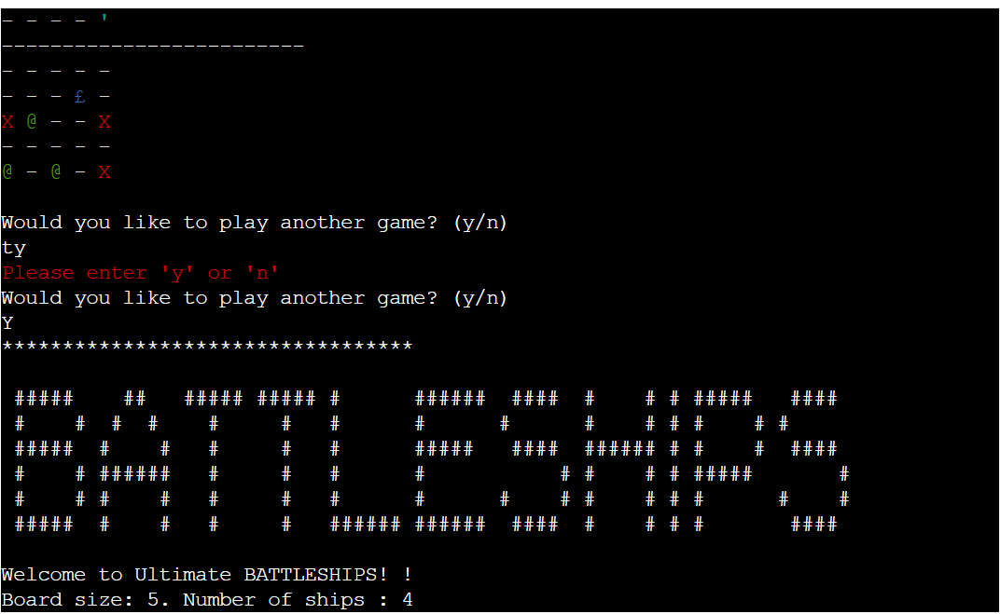

# Ultimate BATTLESHIPS

Ultimate BATTLESHIPS is an enhanced version of the classic Battleship game. The objective is to sink all enemy ships by guessing their positions on the board.

Click [here](https://battlefield-python-5157ebccf7e2.herokuapp.com/) to play the game

## How to Play

The game is played on a 5x5 board. Both the player and the computer place 4 ships on their respective boards. The player has 5 turns to try to sink all the computer's ships.


### Game Instructions

1. **Game Initialization**:
   - The player must enter their name to start the game.
   - Ships are randomly placed on the player and computer boards.



2. **Gameplay**:
   - Each turn, the player must guess a position (row and column) to attack the computer's board.
   - The computer also guesses a position on the player's board.
   - If a ship is hit, the cell is marked with a '$' on the computer's board and a '£' on the player's board.
   - If an attack misses, the cell is marked with an 'X'.

3. **End of the Game**:
   - The game ends after 5 turns or when all ships of a player are sunk.
   - Scores are displayed and the winner is determined based on the number of ships sunk.



# My Game Project

Welcome to my game project. This game is designed to be fun and educational.

## Project Flowchart



## Features

### Enhanced User Interface

- **Color-Coded Board**: The game board uses colors to indicate different states:
  - Green (`@`): Player's ships
  - Blue (`£`): Hit player's ships
  - Yellow (`$`): Hit enemy ships
  - Red (`X`): Missed attack
  - White (`-`): Empty cell
  - Cyan (`'`): Enemy ships (hidden during gameplay)

### Gameplay Mechanics

- **Random Ship Placement**: Ships are randomly placed on both the player's and the computer's boards, ensuring a unique experience every time the game is played.
- **Turn-Based Play**: Players take turns guessing the location of enemy ships, with feedback provided after each guess.
- **Score Tracking**: Scores are tracked throughout the game, and a final score is displayed at the end, declaring the winner.

### Input Validation

- **Player's Name**: Must contain only letters. Prompts for re-entry if the input is invalid.
- **Guess Validation**: Ensures that guesses are numbers between 0 and 4. Invalid inputs prompt for re-entry.

### Game Board

- **Board Size**: 5x5 grid for both the player and the computer.
- **Ship Symbols**: Different symbols represent different states on the board:
  - `@`: Player's ships
  - `'`: Computer's ships (hidden during gameplay)
  - `-`: Empty cell
  - `X`: Missed attack
  - `$`: Hit enemy ship
  - `£`: Hit player ship

### Dynamic Feedback

- **Turn Feedback**: After each turn, players receive feedback on whether their guess was a hit or a miss.
- **Score Updates**: Scores are updated in real-time after each guess, and displayed to the player.

### Game Conclusion

- **End Conditions**: The game ends either after 5 turns or when all ships of a player are sunk.
- **Final Scores**: Displayed at the end of the game, with a message indicating whether the player won, lost, or if it was a draw.

### Testing









The game has been manually tested to ensure it works correctly with different inputs and scenarios.

## Deployment

This project can be run in a local Python environment. To install the dependencies and run the game, use the following commands:

```bash
pip install colorama
python3 run.py

```

## Acknowledgements
- My Mentor Rahul for his ongoing support and feedback
- The Code Institute's Tutor Support