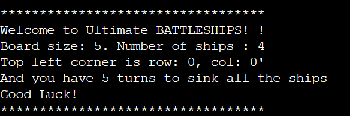

# Ultimate BATTLESHIPS

Ultimate BATTLESHIPS is an enhanced version of the classic Battleship game. The objective is to sink all enemy ships by guessing their positions on the board.


## How to Play

The game is played on a 5x5 board. Both the player and the computer place 4 ships on their respective boards. The player has 5 turns to try to sink all the computer's ships.



### Game Instructions

1. **Game Initialization**:
   - The player must enter their name to start the game.
   - Ships are randomly placed on the player and computer boards.

2. **Gameplay**:
   - Each turn, the player must guess a position (row and column) to attack the computer's board.
   - The computer also guesses a position on the player's board.
   - If a ship is hit, the cell is marked with a '$' on the computer's board and a '£' on the player's board.
   - If an attack misses, the cell is marked with an 'X'.

3. **End of the Game**:
   - The game ends after 5 turns or when all ships of a player are sunk.
   - Scores are displayed and the winner is determined based on the number of ships sunk.

## Features


### Game Board

- The board is a 5x5 grid.
- Ships are represented by symbols:
  - '@' for the player's ships
  - '\'' for the computer's ships
  - '-' for an empty cell
  - 'X' for a missed attack
  - '$' for a hit enemy ship
  - '£' for a hit player ship

### Input Validation

- The player's name must contain only letters.
- Guesses must be numbers between 0 and 4.

### Scores and Messages

- Scores are updated after each turn.
- Success or failure messages are displayed after each attack.
- At the end of the game, the final score and the winner are displayed.

## Testing


The game has been manually tested to ensure it works correctly with different inputs and scenarios.

## Deployment

This project can be run in a local Python environment. To install the dependencies and run the game, use the following commands:

```bash
pip install colorama
python battleships.py

